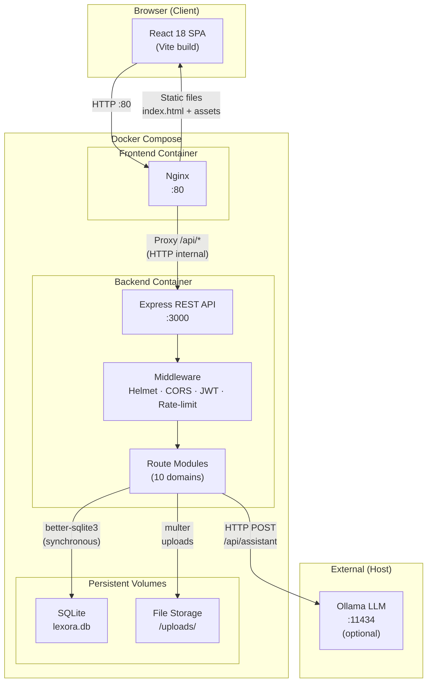
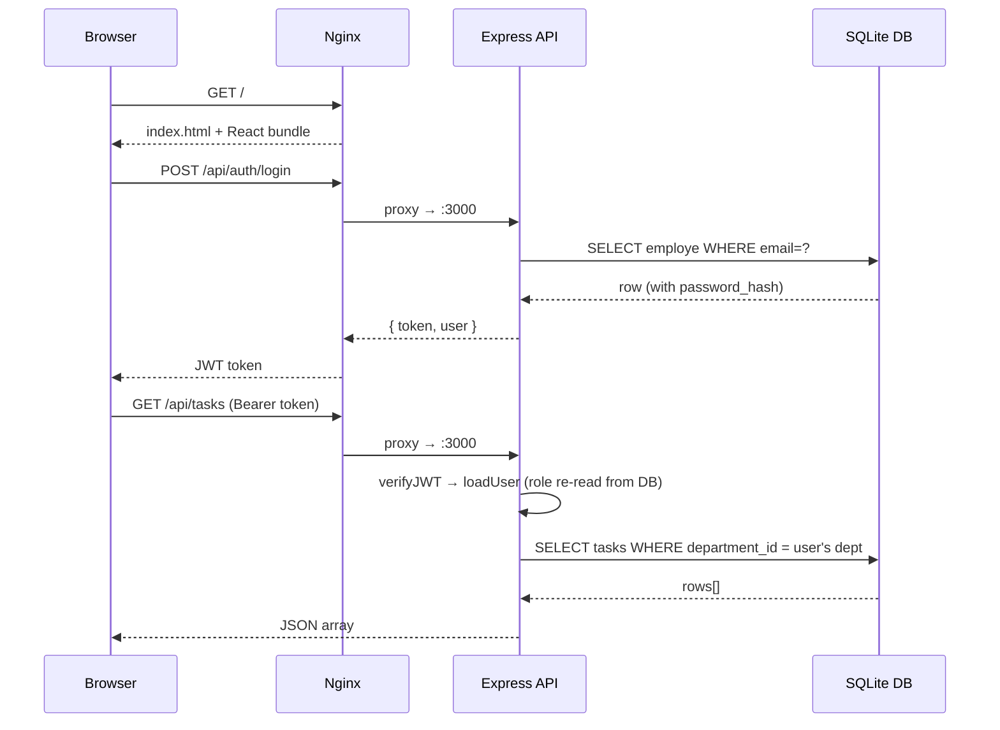
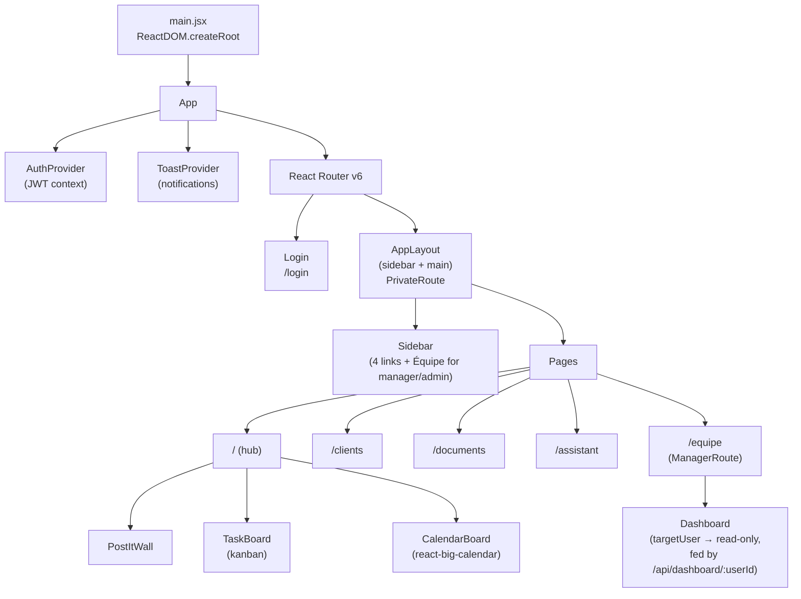
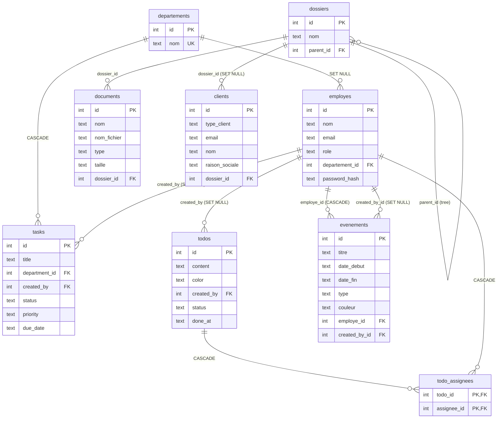

# Lexora — ERP Full-Stack Application

> **Holberton School Portfolio Project** — A full-stack web application for small teams, organized around a **single dashboard hub**: sticky notes, department task board and unified calendar on one page, plus a client CRM with automatic document folders, a document vault, a local AI assistant, and read-only team dashboard consultation for managers.

[](https://nodejs.org)
[](https://react.dev)
[](https://www.sqlite.org)
[](https://docs.docker.com/compose)
[](LICENSE)

---

## Table of Contents

- [Overview](#overview)
- [Features](#features)
- [Roles & Permissions](#roles--permissions)
- [Application Architecture](#application-architecture)
- [Database Diagram](#database-diagram)
- [Tech Stack](#tech-stack)
- [Quick Start](#quick-start)
- [Environment Variables](#environment-variables)
- [API Reference](#api-reference)
- [Project Structure](#project-structure)
- [Security](#security)
- [Team](#team)

---

## Overview

**Lexora** is a centralized workspace for small business operations. Instead of scattering the daily workflow across many screens, everything a user needs lives on **one dashboard**:

1. **Sticky notes (post-its)** — personal mini-tasks, assignable to any colleague, rendered as a colored post-it wall
2. **Department task board** — kanban (todo / in progress / done) shared by the whole department; managers create the tasks ("they give the directives"), everyone moves the cards
3. **Unified calendar** — general events, personal reminders (user-picked colors), and green **planning** blocks placed by the department manager

Around the hub:

- **Clients** — CRM where each client automatically gets a dedicated folder in the document vault
- **Documents** — hierarchical vault with drag-and-drop uploads and authenticated downloads
- **AI Assistant** — chat with a local LLM via Ollama (no data leaves the machine)
- **Équipe** — admins manage employee accounts; **managers consult the dashboard of each member of their department in strict read-only mode**

---

## Features

| Module | Description |
|--------|-------------|
| 🏠 **Dashboard hub** | Post-its → department kanban → calendar, stacked on a single page |
| 📌 **Post-its** | Personal sticky notes with color picker, multi-assignment to colleagues, optimistic done/undone toggle |
| ✅ **Task board** | Department-level kanban: HTML5 drag & drop + select fallback, priority/due-date badges, creation reserved to managers (own department) and admins |
| 📅 **Calendar** | Unified calendar: general events (everyone), personal events (own color, private), and green planning blocks managed by the department manager. Month/week/day views, click-to-create |
| 👁 **Team dashboards** | A manager (or admin) opens the read-only dashboard of an employee: their post-its, department tasks and calendar — zero write action available |
| 👥 **Clients** | Contact management (individual/company); each client gets an auto-created sub-folder under the fixed `Clients/` vault folder; deletion asks explicitly what to do with the folder |
| 📁 **Document Vault** | Folder tree, drag-and-drop upload (50 MB max), authenticated blob download, recursive folder deletion |
| 🤖 **AI Assistant** | Real-time chat with a local LLM (Ollama / llama3.2) |
| 🛡 **Team (Admin)** | Employee directory: account creation with role and department, password reset, deletion with GDPR-aware cascades |

---

## Roles & Permissions

Three roles: `employe` < `manager` < `admin`. The JWT only identifies the user — **the role and department are re-read from the database on every request** (`loadUser` middleware), so a demoted or deleted account loses access instantly.

| Capability | employe | manager | admin |
|---|---|---|---|
| Own dashboard (post-its, department tasks, personal calendar) | ✅ | ✅ | ✅ |
| Create / assign post-its to colleagues | ✅ | ✅ | ✅ |
| Move kanban cards (status) of own department | ✅ | ✅ | ✅ (all) |
| Create / edit / delete department tasks | — | own department | everywhere |
| Place green **planning** events on an employee | — | own department | everywhere |
| Create general / personal calendar events | ✅ | ✅ | ✅ |
| Consult an employee's dashboard (read-only) | — | own department | everyone |
| Manage employee accounts / departments | — | — | ✅ |

**Calendar visibility is personal for every role, admin included**: your dashboard shows general events, events targeting you, events you created, and your own department's planning. Viewing an employee's full schedule goes through the Équipe page (`GET /api/dashboard/:userId`) — never through your own calendar.

---

## Application Architecture

### High-Level Overview



### Request Flow



### Frontend Architecture



The three hub components (`PostItWall`, `TaskBoard`, `CalendarBoard`) have **two modes**: interactive (they fetch their own data) or read-only (data injected via props from a single `GET /api/dashboard/:userId` call). Legacy routes `/taches`, `/calendrier`, `/mon-espace` redirect to `/`; `/business` redirects to `/clients`.

---

## Database Diagram



**9 tables.** Notable design choices:

- `evenements` is the **unified calendar**: one table carries general events (`employe_id NULL`), manager-placed planning (`type='planning'` + target employee, always green `#10b981`), and personal events (target = self, user-picked color).
- `ON DELETE` rules are GDPR-driven: deleting an employee cascades their planning, personal events and todo assignments away, while their created tasks/todos survive **anonymized** (`created_by → NULL`).
- Foreign keys are enforced via `PRAGMA foreign_keys = ON` (off by default in SQLite).
- The schema evolves through **9 idempotent migrations** in `db.js` (each one inspects `PRAGMA table_info` / `sqlite_master` before acting; restarting on a migrated base is a no-op).

---

## Tech Stack

### Backend

| Tool | Purpose |
|------|---------|
| Node.js 18 + Express 4 | REST API |
| better-sqlite3 | Synchronous SQLite driver (no callbacks; ideal for a single-process app) |
| jsonwebtoken | Stateless auth — 24 h tokens, HMAC-SHA256 |
| bcryptjs | Password hashing (cost 10, salted) |
| helmet / cors / express-rate-limit | Security headers · strict origin whitelist · 100 req / 15 min / IP |
| multer | `multipart/form-data` uploads (50 MB cap, disk storage) |

### Frontend

| Tool | Purpose |
|------|---------|
| React 18 + Vite | SPA with fast dev server and build |
| react-router-dom v6 | Client-side routing, `PrivateRoute` / `ManagerRoute` guards |
| react-big-calendar + date-fns | Calendar views (month/week/day), French locale |
| Vanilla CSS (index.css) | Single global stylesheet, design tokens via CSS variables |

### Infrastructure

| Tool | Purpose |
|------|---------|
| Docker Compose | 2 containers (nginx front, node back) + 2 named volumes (SQLite, uploads) |
| Nginx | Serves the static build, `try_files` for SPA routing, proxies `/api/` |
| Ollama (optional, host) | Local LLM for the AI assistant |

---

## Quick Start

### Docker (Recommended)

**Prerequisites:** Docker and Docker Compose installed.

```bash
# 1. Clone the repository
git clone https://github.com/poloelo/Lexora-V2.git
cd Lexora-V2

# 2. Configure environment
#    lexora/.env is already pre-configured for Docker
#    Edit lexora/.env to set your own JWT_SECRET before production use

# 3. Start the application
docker compose up --build

# Application is available at http://localhost
```

**Default admin account:**
```
Email:    admin@lexora.fr
Password: Admin1234!
```

> **AI Assistant:** To enable the AI assistant, install [Ollama](https://ollama.ai) on your host:
> ```bash
> ollama pull llama3.2
> ollama serve
> ```

To stop:
```bash
docker compose down

# Remove volumes (WARNING: deletes all data)
docker compose down -v
```

### Local Development

**Prerequisites:** Node.js 18+, npm.

```bash
# Backend
cd lexora/backend
npm install
npm run seed         # optional: demo departments, employees, tasks, todos, events, clients
npm run dev          # starts with node --watch (auto-reload) on :3000

# Frontend (new terminal)
cd lexora/frontend
npm install
npm run dev          # Vite dev server on http://localhost:5173
```

The Vite dev proxy (`vite.config.js`) automatically forwards `/api/*` to `http://localhost:3000`.

#### Demo accounts (`npm run seed`)

The seed script is idempotent (safe to re-run). Every demo account uses the
password `demo1234`:

| Email | Role | Department |
|-------|------|------------|
| `admin@lexora.fr` | admin | Direction |
| `m.dupont@lexora.fr` | manager | Finance |
| `s.martin@lexora.fr` | employe | Finance |
| `a.petit@lexora.fr` | manager | Technique |
| `j.bernard@lexora.fr` | employe | Technique |
| `c.moreau@lexora.fr` | employe | Ressources Humaines |
| `t.roux@lexora.fr` | employe | Commercial |

---

## Environment Variables

File location: `lexora/.env`

| Variable | Default | Description |
|----------|---------|-------------|
| `PORT` | `3000` | Express server port |
| `DB_PATH` | `./lexora.db` | SQLite file path |
| `JWT_SECRET` | *(required)* | Secret key for signing JWT tokens |
| `ALLOWED_ORIGINS` | `http://localhost` | Comma-separated CORS allowed origins |
| `ADMIN_EMAIL` | — | Seeds an admin account on first startup |
| `ADMIN_PASSWORD` | — | Password for the seeded admin account |
| `OLLAMA_URL` | `http://localhost:11434` | Ollama server URL |
| `OLLAMA_MODEL` | `llama3.2` | LLM model used by the AI assistant |

> **Security:** Never commit your `.env` file. It is listed in `.gitignore`.

---

## API Reference

All endpoints are prefixed with `/api`. **Every business route requires
`Authorization: Bearer <token>`** — only `POST /api/auth/login` and
`GET /api/health` are public. On each authenticated request, the middleware
chain `verifyJWT → loadUser` re-reads role and department from the database.

### Health & Authentication (public)
```
GET  /api/health         → { status: 'ok', timestamp }
POST /api/auth/login     → { token, user }   Body: { email, password }
```

### Department Tasks

Visibility: members see their own department's tasks; admins see everything.
Creation/edit/deletion: `manager` (own department) or `admin`. Status change
(kanban drag): any member of the task's department.

```
GET    /api/tasks             → Task[]   Query: ?status=&priority=&department_id= (department_id: admin only)
POST   /api/tasks             → Task     Body: { title*, department_id*, description, status, priority, due_date }
PUT    /api/tasks/:id         → Task     (manager of the department | admin — including the target department on a move)
PATCH  /api/tasks/:id/status  → Task     Body: { status: 'todo'|'in_progress'|'done' }
DELETE /api/tasks/:id         → { message }
```

### Todos (personal sticky notes)

Visibility: own creations + todos assigned to you. Anyone can assign a
post-it to any colleague. Edit/delete: creator only. Toggle: creator or
assignee.

```
GET    /api/todos             → Todo[] (each with .assignees[])
POST   /api/todos             → Todo   Body: { content* (≤280), color (#rrggbb), assignee_ids[] (default: self) }
PUT    /api/todos/:id         → Todo   (creator only)
PATCH  /api/todos/:id/toggle  → Todo   (creator or assignee — flips done/pending)
DELETE /api/todos/:id         → { message } (creator only)
```

### Calendar Events (unified calendar)

One table, three natures — see [Roles & Permissions](#roles--permissions).
The dashboard calendar is **personal for every role**: general + targeting
me + created by me + my own department's planning.

```
GET    /api/evenements        → Event[] (server-side visibility filter)
GET    /api/evenements/:id    → Event   (404 if invisible — existence not revealed)
POST   /api/evenements        → Event   Body: { titre*, date_debut* (ISO 8601), date_fin, type, couleur, employe_id }
                                        type 'planning' → manager of target's department only, green color forced
PUT    /api/evenements/:id    → Event   (creator | department manager for planning | admin; rights re-checked on final values)
DELETE /api/evenements/:id    → { message } (same rights as PUT)
```

### Dashboard consultation (read-only)

```
GET /api/dashboard/:userId    → { user, todos, tasks, evenements }
```
Guard: **manager of the target's department, or admin — otherwise 403.**
Re-aggregates the exact queries of the three domains "as if" requested by the
target employee. Strictly read-only: no write route exists "on behalf of"
anyone.

### Clients (CRM + automatic vault folder)

```
GET    /api/clients           → Client[]
GET    /api/clients/:id       → Client
POST   /api/clients           → Client  Body: { type_client, email*, nom*|raison_sociale*, telephone, adresse, siret, tva, contact_nom }
                                        Creates the client AND its sub-folder under Clients/ in one transaction
PUT    /api/clients/:id       → Client  (the folder is never auto-renamed)
DELETE /api/clients/:id       → 409 + { requiresConfirmation, dossier_id, dossier_nom } if a folder is linked and no choice given
DELETE /api/clients/:id?deleteDossier=true|false
                              → { message }  true: deletes folder + contents; false: keeps folder, detached
```

### Document Vault

```
GET    /api/documents/dossiers      → Folder[]
POST   /api/documents/dossiers      → Folder   Body: { nom*, description, parent_id }
DELETE /api/documents/dossiers/:id  → { message } (recursive: files on disk + DB rows + sub-folders)
GET    /api/documents               → Document[]  Query: ?dossier_id= (or 'null' for root)
POST   /api/documents/upload        → Document  multipart/form-data: file* (≤50 MB), dossier_id, description
GET    /api/documents/:id/download  → file (original name; requires the JWT header — the frontend fetches a blob)
DELETE /api/documents/:id           → { message } (removes the physical file too)
```

### Employees

```
GET  /api/employes/selector      → [{ id, nom }]                (any authenticated user — assignment pickers)
GET  /api/employes/equipe        → [{ id, nom, poste, departement_nom }]
                                   (manager: own department w/o self; admin: everyone w/o self)
GET  /api/employes               → Employee[]  (admin — password_hash never returned)
GET  /api/employes/:id           → Employee    (admin)
POST /api/employes               → Employee    (admin) Body: { nom*, email*, password*, prenom, poste, departement_id, salaire, date_embauche, role }
PUT  /api/employes/:id           → Employee    (admin)
PUT  /api/employes/:id/password  → { message } (admin)
DELETE /api/employes/:id         → { message } (admin — GDPR cascades, see db.js)
```

### Departments

```
GET    /api/departements      → [{ id, nom }]  (any authenticated user)
POST   /api/departements      → Department     (admin)
PUT    /api/departements/:id  → Department     (admin)
DELETE /api/departements/:id  → { message }    (admin — tasks CASCADE, employees SET NULL)
```

### AI Assistant

```
POST /api/assistant           → { response }   Body: { prompt* }  (proxied to local Ollama)
```

---

## Project Structure

```
Lexora-V2/
├── docker-compose.yml            # 2 services + 2 volumes (sqlite-data, uploads-data)
├── Dockerfile.backend            # Node 18 + C++ toolchain (better-sqlite3 native build)
├── Dockerfile.frontend           # Multi-stage: vite build → nginx:alpine
├── nginx.conf                    # SPA try_files + /api/ reverse proxy
├── REVISION_SOUTENANCE.md        # Oral defense study guide (French)
├── docs/                         # Holberton deliverables (sprint plans, QA, backend guide)
│
└── lexora/
    ├── backend/
    │   ├── index.js              # Entry point: global middlewares + 10 routers
    │   ├── env.js                # dotenv loader (imported first)
    │   ├── middleware/auth.js    # verifyJWT, loadUser, requireRole
    │   ├── models/db.js          # Schema + 9 idempotent migrations + admin seed
    │   ├── services/ollamaService.js
    │   ├── routes/               # 1 file = 1 domain (route + controller)
    │   │   ├── auth.js           ├── tasks.js        ├── todos.js
    │   │   ├── departements.js   ├── employes.js     ├── clients.js
    │   │   ├── evenements.js     ├── documents.js    ├── assistant.js
    │   │   └── dashboard.js      # read-only employee dashboard (manager/admin)
    │   ├── scripts/seed.js       # Idempotent demo data
    │   └── uploads/              # Physical files (Docker volume in prod)
    │
    └── frontend/
        └── src/
            ├── main.jsx / App.jsx / index.css
            ├── contexts/         # AuthContext (JWT), ToastContext
            ├── components/       # PostItWall, TaskBoard, CalendarBoard
            │                     #  (each: interactive OR read-only via props)
            └── pages/            # Dashboard (hub), Clients, Coffre_fort,
                                  #  Assistant, Equipe, Login
```

---

## Security

- **JWT (24 h)** signed HMAC-SHA256; the payload only *identifies* — on every request `loadUser` re-reads role/department from the DB, so authorization never trusts the token
- **bcrypt** (cost 10) password hashing; hashes never leave the server
- **All business routes behind JWT** — only login and health are public
- **Prepared statements everywhere** (`?` placeholders) — no SQL injection surface
- **helmet** security headers, **strict CORS** whitelist, **rate-limit** 100 req/15 min/IP
- **Input validation**: enum whitelists (status, priority, roles, event types), regex checks (dates, hex colors), FK existence checks, 280-char todo cap, 50 MB upload cap
- **GDPR-aware deletes**: employee deletion cascades personal data (planning, assignments, personal events) and anonymizes authored content (`created_by → NULL`)
- **Data minimization**: `/api/employes/selector` exposes only `{id, nom}`; `password_hash` is never selected into a response; the read-only dashboard returns a minimal user card (no email/salary)
- **Read-only by construction**: the manager consultation view has no write API at all — not just hidden buttons

---

## Team

Project completed as part of the **Holberton School** curriculum.

| Name | Role |
|------|------|
| **Polo** | Full-Stack Developer — Backend API, Auth, Database, Docker |
| *(co-author)* | Full-Stack Developer — Frontend React, UI/UX, Components |

---

## License

This project is an educational portfolio project — free to use for non-commercial purposes.
